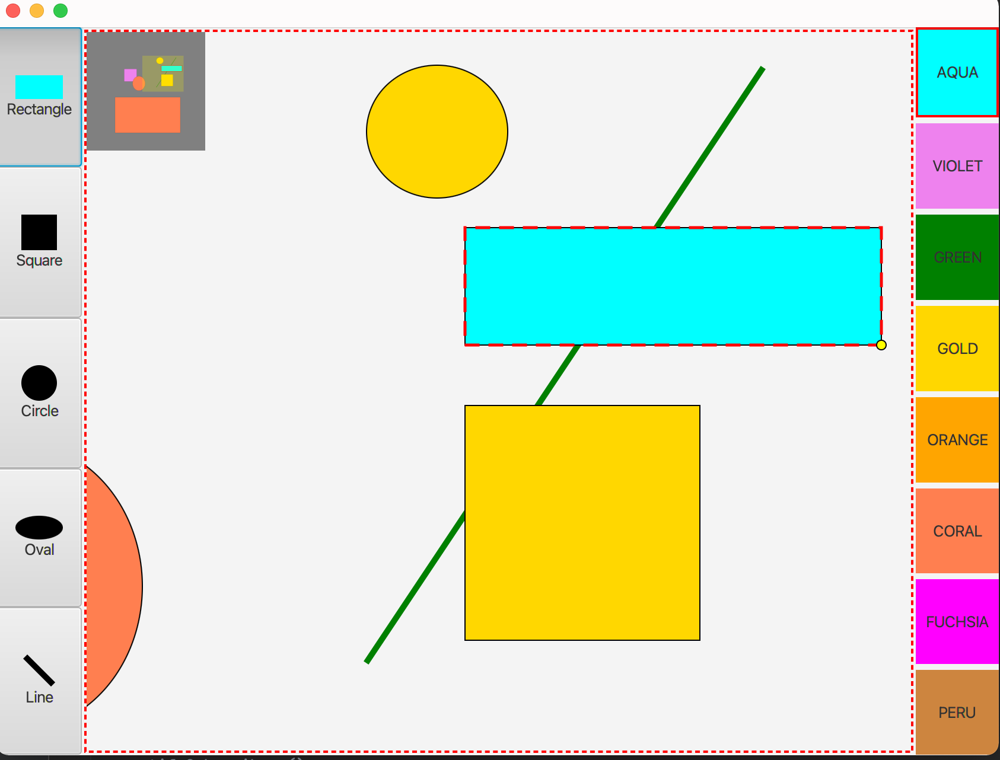

## Overview
A JavaFX drawing program that requires understanding of immediate-mode graphics, interaction with graphics, more complex model-view-controller architectures, and multiple synchronized visual representations of the model. There is a miniature view at the top-left (which shows the entire document) and the main surface (where user draws shapes) and both can be used for drawing, selection, and navigation.

## Functionalities
* Drawing: drag the mouse on the surface
* Selection: single-click on a shape. The selected shape will be moved at the front of all other shapes
* Resizing:  choose  the shape and drag the yellow handle
* Moving: Drag the shape
* Deletion:  choose the shape and press Delete key
* Panning:
    * Press the right-mouse button and drag
    * Drag the viewfinder (the yellow rectangle in the miniature view)
## Technologies
* Intelliji
* Java
* JavaFX
